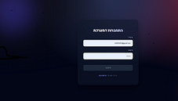
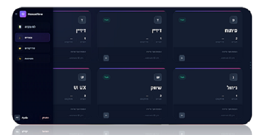
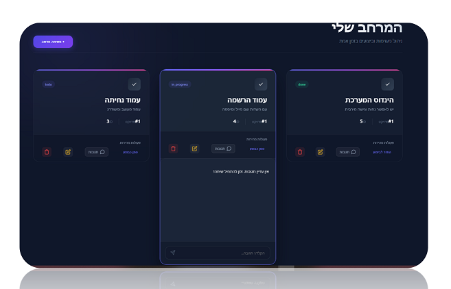
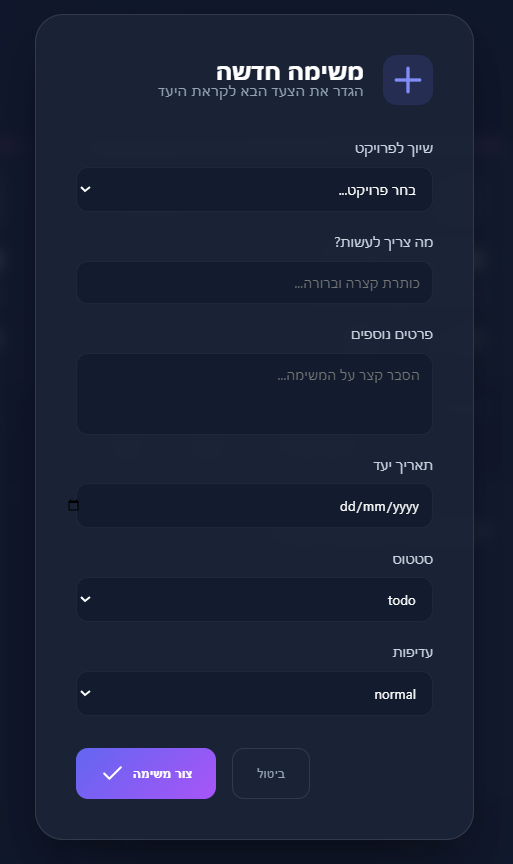

🚀 NexusFlow - System for Team & Task Management
NexusFlow היא פלטפורמה מודרנית לניהול פרויקטים ומשימות בזמן אמת, המיועדת לצוותים שרוצים לשפר את הפרודוקטיביות והסדר בארגון. המערכת מאפשרת ניהול היררכי של צוותים, פרויקטים ומשימות עם ממשק משתמש מתקדם וחוויית שימוש חלקה.

✨ תכונות עיקריות (Key Features)
ניהול היררכי: הקמת צוותים, שיוך פרויקטים לצוותים ויצירת משימות מפורטות.

לוח בקרה (Dashboard): סקירה כללית של ביצועים, אחוזי השלמה ופעילות אחרונה.

ניהול משימות חכם: עריכת סטטוס (Todo/In Progress/Done), עדיפויות ותאריכי יעד.

שיתוף פעולה: מערכת תגובות מובנית לכל משימה לשיח צוותי.

ממשק משתמש (UI): עיצוב Dark Mode מודרני, מבוסס זכוכית (Glassmorphism) עם אנימציות חלקות.

אבטחה: מערכת הרשמה והתחברות (Authentication) מאובטחת.

🛠 טכנולוגיות (Tech Stack)
Frontend
Angular 18/20: שימוש ב-Signals, Standalone Components ו-Reactive Forms.

CSS3: עיצוב מתקדם, Flexbox/Grid ואנימציות מותאמות אישית.

Lucide/SVG Icons: מערכת אייקונים וקטורית וקלה.

Backend
Node.js & Express: שרת API מהיר ויציב.

PostgreSQL: בסיס נתונים רלציוני לניהול המידע.

Render: אירוח (Hosting) של השרת והקליינט.

🚀 הרצה מקומית (Getting Started)
דרישות קדם:
Node.js מותקן

Angular CLI מותקן

שלבי התקנה:
שיבוט הפרויקט:

Bash
git clone https://github.com/h48503652-web/AngularProject
cd nexus-flow
התקנת תלויות:

Bash
### עבור השרת
cd server
npm install

### עבור הקליינט
cd ../client
npm install
הרצת הפרויקט:

Bash
### הפעלת השרת
node server.js

# הפעלת האנגולר (בטרמינל נפרד)
ng serve
האתר יהיה זמין בכתובת: http://localhost:4200

📂 מבנה הפרויקט (Project Structure)
Plaintext
nexus-flow/
├── client/                # Angular Frontend
│   ├── src/app/
│   │   ├── components/    # Reusable UI Components
│   │   ├── services/      # API & Logic Services
│   │   └── environments/  # Prod/Dev configurations
├── server/                # Node.js Backend
│   ├── server.js          # API Routes & Express Config
│   └── database/          # SQL Schemas & DB Logic
└── README.md

## 📸 System Snapshots

### 📊 Real-time Dashboard

התחברות והרשמה בכניסה למערכת .

### ✅ Teams Management
מערכת הצוותים עם אפשרות להוסםת צוות

### ✅ Task Management
מערכת גריד חכמה לניהול משימות, כולל סינון, עריכה ומעקב סטטוס.

טופס יצירת משימה חדשה .

📝 רישיון
פרויקט זה נוצר כחלק מתיק עבודות אישי. כל הזכויות שמורות © 2026.